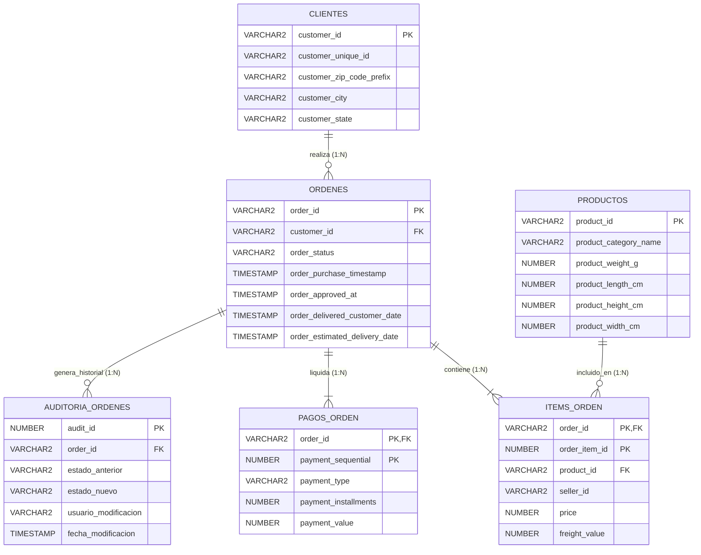

# 🛒 E-Commerce Data Engineering & Business Logic with Oracle PL/SQL

Arquitectura relacional completa para la gestión, auditoría y análisis de transacciones de un comercio electrónico a escala empresarial utilizando **Oracle Database (19c/21c)**, **SQL Avanzado** y **PL/SQL**.

El proyecto toma como base el dataset transaccional de **Olist E-Commerce** (más de 100,000 registros), implementando normalización en tercera forma normal (3FN), integridad referencial estricta, índices de optimización, procedimientos almacenados con control de transacciones, triggers reactivos y procesos ETL para poblamiento de Data Marts.

---

## 📐 Diagrama Entidad-Relación (ERD)



---

## 🛠️ Stack Tecnológico

* **Motor de Base de Datos:** Oracle Database (19c / 21c XE).
* **Lenguajes:** SQL ANSI / Oracle PL/SQL.
* **Herramientas:** Oracle SQL Developer, SQLcl.
* **Modelo Relacional:** 5 tablas principales interconectadas + tablas de auditoría y Data Mart analítico.

---

## 🚀 Módulos de Lógica de Negocio en PL/SQL

### 1. Consultas Analíticas y Vistas de Alto Rendimiento
* **Métricas de Consumo:** Agregaciones financieras por cliente (LTV, frecuencia de compra y ticket promedio).
* **Eficiencia Logística:** Rentabilidad neta y costos de flete por categoría usando cláusulas modernas de paginación (`FETCH FIRST N ROWS ONLY`).
* **Data Quality & Integridad:** Consultas `Anti-Join` (`LEFT JOIN ... WHERE IS NULL`) para detectar órdenes sin ítems o pagos huérfanos.
* **Capa Semántica:** Vista materializable `v_detalle_pedidos_completo` para consumo directo de tableros de BI.

### 2. Procedimientos Almacenados y Control Transaccional
* **`sp_cancelar_orden`:** Validación del ciclo de vida del pedido; bloquea cancelaciones de órdenes ya despachadas y gestiona excepciones (`NO_DATA_FOUND`).
* **`sp_registrar_pago`:** Cálculo dinámico del correlativo de pago secuencial e inserción parametrizada con control de importes.
* **`sp_kpis_cliente`:** Procedimiento con parámetros `OUT` desacoplado para ser consumido por endpoints de backend o microservicios.
* **`sp_auditar_ordenes_caras`:** Procesamiento por lotes utilizando un **cursor explícito** (`CURSOR`, `OPEN`, `FETCH`, `CLOSE`) para identificar compras de alto riesgo financiero.
* **`sp_actualizar_categoria_nula`:** Manejo de variables de entorno de cursor implícito (`SQL%ROWCOUNT`) para registrar el volumen exacto de registros modificados.

### 3. Triggers Reactivos y Arquitectura Modular (Packages)
* **`trg_auditar_estado_orden`:** Trigger `AFTER UPDATE` sobre `ordenes` que almacena automáticamente el estado previo, estado nuevo, usuario del sistema y estampa de tiempo en `auditoria_ordenes`.
* **`trg_validar_fecha_entrega`:** Trigger `BEFORE UPDATE` que impide fechas de entrega anteriores a la fecha de compra mediante excepciones de aplicación (`RAISE_APPLICATION_ERROR`).
* **`pkg_gestion_pedidos`:** Paquete modular (especificación y cuerpo) que encapsula funciones de costeo total y procedimientos de transición de estados.
* **`pkg_reportes_financieros`:** Paquete con cursores parametrizados para la emisión de reportes ejecutivos.
* **`sp_cargar_resumen_mensual`:** Procedimiento ETL interno con SQL dinámico (`EXECUTE IMMEDIATE`) para poblar la tabla dimensional agregada `dm_resumen_mensual`.

---

## ⚡ Estrategia de Rendimiento e Indexación

Para garantizar tiempos de respuesta en subsegundos sobre más de 100,000 tuplas, se implementaron índices B-Tree sobre las claves foráneas y columnas de filtrado recurrente:

```sql
CREATE INDEX idx_ordenes_cliente  ON ordenes(customer_id);
CREATE INDEX idx_items_producto   ON items_orden(product_id);
CREATE INDEX idx_items_vendedor   ON items_orden(seller_id);
CREATE INDEX idx_pagos_orden      ON pagos_orden(order_id);
CREATE INDEX idx_ordenes_estado   ON ordenes(order_status);
```

---

## 💻 Instrucciones de Instalación y Despliegue

1. **Conexión:** Abrir **Oracle SQL Developer** o conectarse mediante **SQLcl** a una instancia local o remota de Oracle Database.
2. **Definición de Esquema:** Ejecutar los scripts DDL de creación de tablas, llaves primarias/foráneas e índices B-Tree.
3. **Ingesta de Datos:** Cargar los archivos CSV asegurando el siguiente orden de dependencias referenciales:
   $$\text{clientes} \longrightarrow \text{productos} \longrightarrow \text{ordenes} \longrightarrow \text{items\_orden} \longrightarrow \text{pagos\_orden}$$
4. **Compilación PL/SQL:** Compilar en la base de datos los scripts con procedimientos, funciones, triggers y paquetes (`PACKAGE SPEC` y `PACKAGE BODY`).