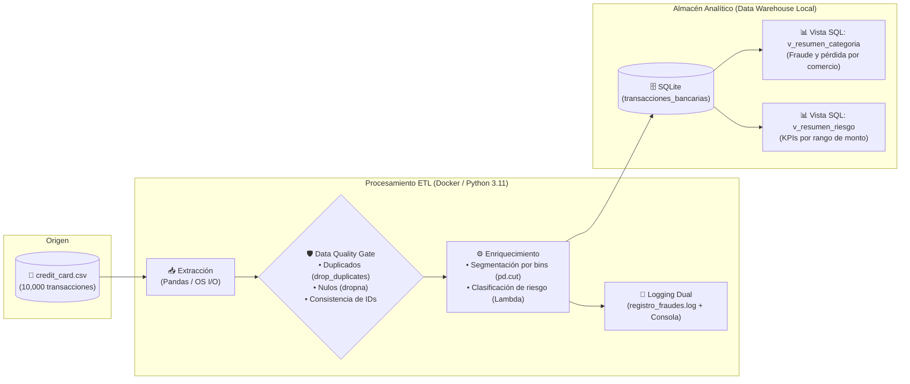

# 💳 Credit Card Fraud Detection Pipeline (ETL & Analytical Views)

Pipeline automatizado de ingeniería de datos para la extracción, limpieza, enriquecimiento y modelado analítico de transacciones financieras, enfocado en la detección temprana de anomalías y prevención de fraude en comercios.

---

## 📐 Arquitectura del Flujo de Datos

El pipeline sigue una arquitectura por capas desacoplada y reproducible en contenedores:



---

## 🛠️ Stack Tecnológico

* **Lenguaje:** Python 3.11
* **Manipulación de Datos:** Pandas 3.x, NumPy
* **Motor Analítico:** SQLite3 (Modelado Relacional y Vistas Agregadas)
* **Infraestructura y Contenedores:** Docker & Docker Compose
* **Trazabilidad:** Módulo `logging` nativo (Handlers simultáneos para archivo persistente y consola UTF-8)

---

## 🔍 Reglas de Negocio y Transformaciones

1. **Garantía de Unicidad:** Deduplicación estricta a nivel de clave primaria transaccional (`transaction_id`).
2. **Segmentación de Exposición Financiera:** Clasificación de transacciones mediante discretización en rangos (`pd.cut`):
   * `Bajo (0 - 50 USD)`
   * `Medio (50 - 200 USD)`
   * `Alto (200 - 1000 USD)`
   * `Crítico (> 1000 USD)`
3. **Capa Semántica SQL:**
   * `v_resumen_categoria`: Consolida volumen total, tasa de fraude, ticket promedio y monto total defraudado por categoría (`merchant_category`).
   * `v_resumen_riesgo`: Métricas agregadas por nivel de riesgo monetario para análisis forense.

---

## 🚀 Despliegue y Ejecución

### Opción 1: Con Docker (Recomendado / Entorno Aislado)

No requiere tener instalado Python ni librerías locales en la máquina anfitriona.

```bash
# 1. Posicionarse en el directorio del pipeline
cd pipelines/01-pipeline-fraude_tarjetas_de_credito

# 2. Levantar el contenedor y ejecutar el flujo
docker compose up
```

> **Nota:** Mediante volúmenes montados (`volumes: - ./:/app`), tanto la base de datos `fraud_warehouse.db` como el log de auditoría `registro_fraudes.log` se sincronizan automáticamente en tu disco duro local al finalizar la corrida.

### Opción 2: Ejecución Local en Windows / Linux

```bash
# 1. Crear y activar entorno virtual
python -m venv venv
# Windows:
.\venv\Scripts\activate
# Linux/Mac:
source venv/bin/activate

# 2. Instalar dependencias requeridas
pip install -r requirements.txt

# 3. Ejecutar pipeline
python etl_pipeline.py
```

---

## 📊 Salida de Ejecución y Auditoría

Al finalizar, el pipeline reporta las métricas directamente en consola y las persiste en `registro_fraudes.log`:

```text
2026-09-03 16:11:49 [INFO] etl_pipeline : [1/3] Se Extraen Los datos desde: /app/data/credit_card.csv
2026-09-03 16:11:49 [INFO] etl_pipeline : -> Total transacciones extraídas: 10,000
2026-09-03 16:11:49 [INFO] etl_pipeline : [2/3] Transformando y enriqueciendo transacciones...
2026-09-03 16:11:49 [INFO] etl_pipeline : -> Registros duplicados eliminados: 0
2026-09-03 16:11:49 [INFO] etl_pipeline : -> Total transacciones procesadas: 10,000
2026-09-03 16:11:50 [INFO] etl_pipeline : [3/3] Cargando datos en almacén relacional...
2026-09-03 16:11:50 [INFO] etl_pipeline : -> Tabla 'transacciones_bancarias' y vistas analíticas creadas con éxito.
2026-09-03 16:11:50 [INFO] etl_pipeline : --- REPORTE DE FRAUDE POR CATEGORÍA DE COMERCIO (GENERADO POR SQL) ---
2026-09-03 16:11:50 [INFO] etl_pipeline : Comercio: Clothing        | Transacciones: 2050  | Fraudes: 24  | Defraudado: $3,884.94
2026-09-03 16:11:50 [INFO] etl_pipeline : Comercio: Electronics     | Transacciones: 1923  | Fraudes: 24  | Defraudado: $5,855.07
2026-09-03 16:11:50 [INFO] etl_pipeline : Comercio: Food            | Transacciones: 2093  | Fraudes: 35  | Defraudado: $7,534.58
2026-09-03 16:11:50 [INFO] etl_pipeline : Comercio: Grocery         | Transacciones: 1944  | Fraudes: 39  | Defraudado: $8,684.52
2026-09-03 16:11:50 [INFO] etl_pipeline : Comercio: Travel          | Transacciones: 1990  | Fraudes: 29  | Defraudado: $6,684.52
2026-09-03 16:11:50 [INFO] etl_pipeline : ✅ Pipeline Financiero ejecutado exitosamente.
```

---

## 📈 Próximos Pasos de Escalabilidad

* **Desacoplamiento de Almacenamiento:** Migrar el almacenamiento local de CSV hacia buckets de almacenamiento de objetos (Amazon S3 o MinIO autohospedado).
* **Orquestación Programada:** Envolver las fases de extracción y carga en tareas parametrizadas mediante DAGs de Apache Airflow.
* **Cargas Incrementales:** Implementar detección de cambios (*Change Data Capture* o marcas de tiempo de ingestión) para sustituir el reemplazo total de la tabla por cargas append particionadas por fecha.