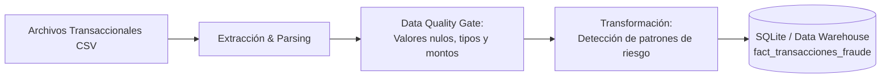

# 💳 Financial Fraud Detection Pipeline (ETL)

Pipeline de ingestión, validación de calidad y detección de anomalías transaccionales para prevención de fraude con tarjetas de crédito.

## 📐 Arquitectura del Flujo de Datos



## 🛠️ Tecnologías Utilizadas
* **Lenguaje:** Python 3.11
* **Manipulación de Datos:** Pandas
* **Almacenamiento Analítico:** SQLite (Modelo dimensional tabular)
* **Infraestructura:** Docker & Docker Compose
* **Monitoreo & Logs:** Módulo `logging` nativo estructurado

## 🔍 Reglas de Calidad y Detección
1. **Filtros de Integridad:** Descarte automático de identificadores duplicados y valores de montos `<= 0`.
2. **Flags de Riesgo:** Identificación de patrones transaccionales anómalos (alto valor transaccional en ventanas nocturnas no habituales).
3. **Auditabilidad:** Cada registro cargado incluye un campo `ingestion_timestamp` en UTC para trazabilidad de linaje de datos.

## 🚀 Cómo Ejecutar el Proyecto

### Opción 1: Con Docker (Recomendado)
```bash
docker compose up --build
```

### Opción 2: Entorno Virtual Local
```bash
# 1. Crear y activar entorno virtual
python -m venv venv
source venv/Scripts/activate  # En Windows

# 2. Instalar dependencias
pip install -r requirements.txt

# 3. Ejecutar pipeline
python etl_pipeline.py
```