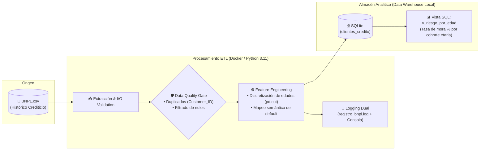

# 📊 Buy Now Pay Later (BNPL) Credit Risk Pipeline (ETL)

Pipeline automatizado de ingeniería de datos para la ingesta, validación de integridad, ingeniería de variables y modelado dimensional sobre carteras crediticias de financiamiento a plazos (**BNPL**).

---

## 📐 Arquitectura del Flujo de Datos



---

## 🛠️ Tecnologías Utilizadas

* **Lenguaje:** Python 3.11
* **Librerías:** Pandas 3.x, NumPy
* **Base de Datos Analítica:** SQLite3 (Persistencia relacional y capa semántica de vistas)
* **Contenerización:** Docker & Docker Compose
* **Trazabilidad:** Módulo `logging` nativo estructurado con codificación UTF-8

---

## 🔍 Reglas de Negocio e Ingeniería de Datos

1. **Unicidad de Sujetos de Crédito:** Control estricto de duplicidad sobre `Customer_ID` garantizando registros atómicos por cliente.
2. **Discretización Etaria Dinámica:** Segmentación de usuarios mediante intervalos semiabiertos (`pd.cut` con `right=False`):
   * `Joven (18 - 25 años)`
   * `Adulto Joven (26 - 40 años)`
   * `Adulto (41 - 60 años)`
   * `Senior (> 60 años)`
3. **Métrica SQL de Morosidad:**
   * La vista `v_riesgo_por_edad` calcula en tiempo de consulta la tasa de mora agregada mediante agregación condicional:
     $$\text{Tasa de Mora (\%)} = \text{AVG}(\text{Default\_Risk}) \times 100$$

---

## 🚀 Despliegue y Ejecución

### Opción 1: Con Docker (Recomendado)

```bash
# 1. Posicionarse en el directorio
cd pipelines/02-pipeline-bnpl

# 2. Construir y ejecutar el contenedor
docker compose up --build
```

> **Persistencia:** Gracias al volumen mapeado (`./:/app`), tanto `bnpl_analytics.db` como `registro_bnpl.log` se sincronizan automáticamente en tu sistema de archivos local.

### Opción 2: Entorno Local

```bash
# 1. Crear y activar entorno virtual
python -m venv venv
.\venv\Scripts\activate  # En Windows

# 2. Instalar requerimientos
pip install -r requirements.txt

# 3. Ejecutar pipeline
python bnpl_pipeline.py
```

---

## 📥 Estructura de Datos Requerida

El dataset debe ubicarse en la carpeta `data/`:
```text
pipelines/02-pipeline-bnpl/
├── data/
│   └── BNPL.csv          # Dataset de Kaggle: Buy Now Pay Later Default Risk
├── Dockerfile
├── docker-compose.yml
├── bnpl_pipeline.py
├── requirements.txt
└── README.md
```

---

## 📈 Escalabilidad Productiva

* **Ingesta por Streaming / Micro-batch:** Adaptar la extracción para consumir eventos transaccionales desde un tópico de Apache Kafka o AWS Kinesis.
* **Persistencia en Data Lakehouse:** Migración hacia tablas Delta Lake o formato Apache Parquet particionadas por fecha de desembolso crediticio.